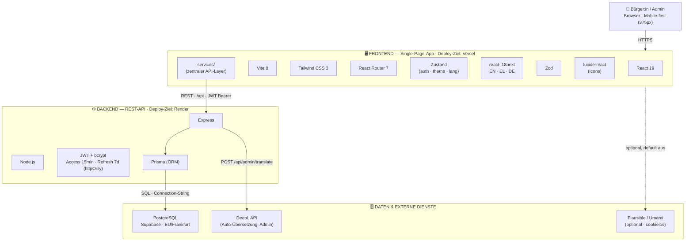

# Tech-Stack & Architektur — Präsentations-Diagramm

> Blueprint für **eine** Präsentationsfolie: zeigt den gesamten Tech-Stack der ZOE-Plattform
> und die Abhängigkeiten (Daten-/Request-Fluss). Zum Nachbauen mit Logos — siehe Tabelle + Logo-Quellen unten.
> Stand: nach der Migration auf PostgreSQL/Supabase (DEVLOG Iteration 11).

---

## 1. Architektur-Diagramm (Mermaid) — der Abhängigkeitsfluss



> **Kernaussage der Pfeile (= die Abhängigkeiten):** Das Frontend spricht **nie** direkt mit der DB —
> nur über den `services/`-Layer → REST-API (Backend) → Prisma → PostgreSQL. Dadurch ist die DB
> austauschbar (Supabase → Gemeinde-Postgres = nur Connection-String tauschen).

---

## 2. Box-Variante zum Nachbauen (Layer-Layout für die Folie)

```
        ┌──────────────────────────────────────────────────────────┐
        │   👤  Bürger:in / Admin  —  Browser (Mobile-first 375px)   │
        └───────────────────────────┬──────────────────────────────┘
                                     │  HTTPS
        ┌────────────────────────────▼─────────────────────────────┐
        │  FRONTEND  (SPA · Deploy: Vercel)                          │
        │  [React 19] [TypeScript] [Vite 8] [Tailwind CSS]          │
        │  [React Router 7] [Zustand] [react-i18next] [Zod] [lucide] │
        │  └─ services/  (zentraler API-Layer)                      │
        └───────────────────────────┬──────────────────────────────┘
                                     │  REST · /api · JWT Bearer
        ┌────────────────────────────▼─────────────────────────────┐
        │  BACKEND  (REST-API · Deploy: Render)                      │
        │  [Node.js] [Express] [TypeScript]                         │
        │  [JWT + bcrypt]   →   [Prisma ORM]                        │
        └───────────────┬───────────────────────┬──────────────────┘
            SQL (string)│                        │ HTTPS
        ┌────────────────▼────────────┐   ┌───────▼───────────────────┐
        │  PostgreSQL (Supabase, EU)   │   │  DeepL API (Übersetzung)  │
        └──────────────────────────────┘   │  Plausible/Umami (opt.)   │
                                            └───────────────────────────┘

   QUER ÜBER ALLES:  TypeScript (strict) · Tests: Vitest · Playwright · axe-core
                     Tooling: ESLint · Prettier · Husky · lint-staged
```

---

## 3. Komponenten + Logos (was auf die Folie gehört)

### Frontend
| Technologie | Rolle | Logo (Quelle) |
|---|---|---|
| **React 19** | UI-Framework | devicon: `react` |
| **TypeScript** | Sprache (strict) | devicon: `typescript` |
| **Vite 8** | Build-Tool / Dev-Server | devicon: `vitejs` |
| **Tailwind CSS 3** | Styling | devicon: `tailwindcss` |
| **React Router 7** | Routing | simpleicons: `reactrouter` |
| **Zustand** | State (auth/theme/lang) | offizielles Repo-Logo (Bär) |
| **react-i18next** | i18n EN/EL/DE | simpleicons: `i18next` |
| **Zod** | Schema-Validierung | simpleicons: `zod` |
| **lucide-react** | Icons | simpleicons: `lucide` |

### Backend
| Technologie | Rolle | Logo (Quelle) |
|---|---|---|
| **Node.js** | Runtime | devicon: `nodejs` |
| **Express** | Web-Framework / REST | devicon: `express` |
| **TypeScript** | Sprache | devicon: `typescript` |
| **JWT** | Auth-Tokens (15min/7d) | simpleicons: `jsonwebtokens` |
| **bcryptjs** | Passwort-Hashing | (Text/Schloss-Icon) |
| **Prisma** | ORM (DB-Zugriff) | devicon: `prisma` / simpleicons: `prisma` |

### Daten & externe Dienste
| Technologie | Rolle | Logo (Quelle) |
|---|---|---|
| **PostgreSQL** | Datenbank | devicon: `postgresql` |
| **Supabase** | Postgres-Hosting (EU) | simpleicons: `supabase` |
| **DeepL API** | Auto-Übersetzung (Admin) | simpleicons: `deepl` |
| **Plausible / Umami** | Analytics (optional) | simpleicons: `plausibleanalytics` / `umami` |

### Quer über alles (Qualität / Betrieb)
| Technologie | Rolle | Logo (Quelle) |
|---|---|---|
| **Vitest** | Unit-/Integrationstests | simpleicons: `vitest` |
| **Playwright** | E2E-Tests | devicon: `playwright` |
| **axe-core** | Accessibility-Tests | (Deque/axe-Logo) |
| **ESLint** | Linting | devicon: `eslint` |
| **Prettier** | Formatierung | simpleicons: `prettier` |
| **Husky + lint-staged** | Git-Hooks (pre-commit) | (Text) |
| **Vercel** | Frontend-Hosting | simpleicons: `vercel` |
| **Render** | Backend-Hosting | simpleicons: `render` |

---

## 4. Beschriftung der Pfeile (Abhängigkeiten — wichtig für die Aussage)

| Von → Nach | Beschriftung | Was es zeigt |
|---|---|---|
| Browser → Frontend | `HTTPS` | Auslieferung der SPA |
| Frontend `services/` → Backend | `REST · /api · JWT Bearer` | einziger Weg an Daten; Token im Header |
| Browser ↔ Backend | `Refresh-Token (httpOnly Cookie)` | sichere Session-Erneuerung |
| Backend → Prisma → PostgreSQL | `SQL · Connection-String` | austauschbare DB (kein Lock-in) |
| Backend → DeepL | `POST /api/admin/translate` | externe Übersetzung |
| Frontend → Analytics | `optional` | cookieloses Monitoring (default aus) |

---

## 5. Logo-Quellen (kostenlos, einheitlicher Look)

- **devicon.dev** — Logos für Programmiersprachen/Tools (React, TypeScript, Node, Postgres, Prisma … als SVG/Font).
- **simpleicons.org** — Marken-Logos (Supabase, DeepL, Vercel, Vitest, Zod …), einfarbig, gut für ein cleanes Design.
- **vectorlogo.zone** — farbige Marken-SVGs als Alternative.
- Fallback: offizielle Website / Press-Kit der jeweiligen Technologie.

> **Tipp für die Folie:** 3 horizontale Bänder (**Frontend / Backend / Daten**) mit den Logos darin,
> dazwischen **beschriftete Pfeile** (HTTPS → REST/JWT → SQL). Die Quer-Tools (TypeScript, Tests,
> Tooling) als schmale Leiste unten. Halte es auf **~3 Ebenen + externe Dienste** — sonst wird's zu voll.
> Optionaler roter Faden im Vortrag: „**Ein** zentraler Datenpfad, DB **austauschbar** → übergabefähig an die Gemeinde."
